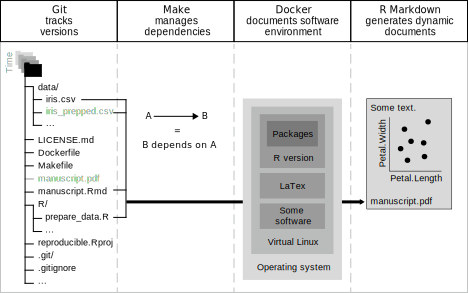

<!-- README.md is generated from README.Rmd. Please edit that file -->

# A Hitchhiker’s Guide to Reproducible Research

<!-- badges: start -->

[](https://www.repostatus.org/#active)

Preregistration as Code:
[](https://doi.org/10.5281/zenodo.5170740)

Results after Preregistration:
[](https://doi.org/10.5281/zenodo.5171678)

[📃Preprint📃](https://www.doi.org/10.31234/osf.io/fwxs4)

<!-- badges: end -->

## How to reproduce this manuscript

To reproduce this project Git, Make, and Docker is required (see [the
installation
guide](https://github.com/aaronpeikert/repro-tutorial/blob/main/install.md)).

Open the terminal, download the repository, and enter the directory:

``` bash
git clone https://github.com/aaronpeikert/repro-tutorial.git
cd repro-tutorial
```

Then build the Docker image, and run Make:

``` bash
make docker &&
make -B DOCKER=TRUE 
```

## Abstract

Computational reproducibility is the ability to obtain identical results
from the *same* data with the *same* computer code. It is a building
block for transparent and cumulative science because it enables the
originator and other researchers, on other computers and later in time,
to reproduce and thus understand how results came about while, at the
same time, it avoids a variety of errors that may lead to erroneous
reporting of statistical and computational results. In this tutorial, we
demonstrate how the R package `repro` supports researchers in creating
fully computationally reproducible research projects with tools from the
software engineering community. Building upon this notion of fully
automated reproducibility we present several applications including the
preregistration of research plans with code (Preregistration as Code,
PAC). PAC eschews all ambiguity of traditional preregistration and
offers several other advantages. Making technical advancements that
serve reproducibility more widely accessible for researchers holds the
potential to innovate the research process to become more productive,
credible, and reliable.

<!-- -->

## Code of Conduct

Please note that the repro-tutorial project is released with a
[Contributor Code of
Conduct](https://contributor-covenant.org/version/2/0/CODE_OF_CONDUCT.html).
By contributing to this project, you agree to abide by its terms.
